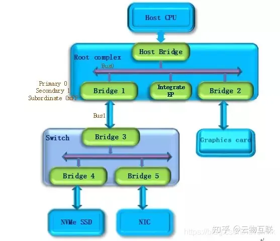
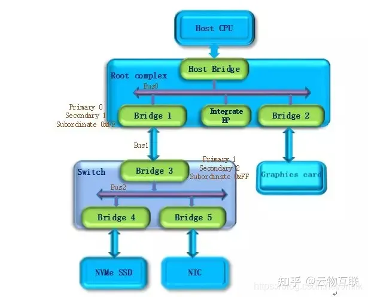
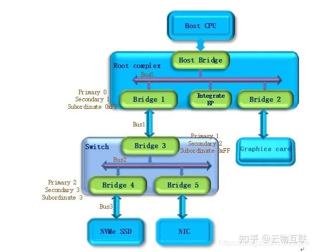
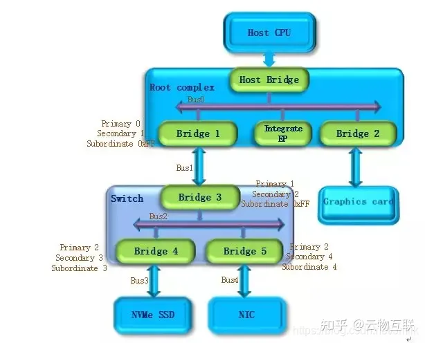
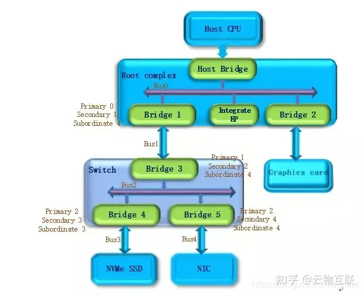

## DMA传输与PCIe传输

> 参考：
>
> [DMA外设详解](https://blog.csdn.net/k666499436/article/details/124492786)
>
> [DMA原理介绍](https://zhuanlan.zhihu.com/p/138573828)
>
> [PCIe传输和DMA传输有什么区别？](https://www.zhihu.com/question/550129239)

### DMA简介

直接存储器存取(Direct Memory Access)是一个挂载在AHB总线上的外设，将数据从一个地址空间复制到另一个地址空间，用来提供外设和存储器之间或存储器与存储器之间的高速数据传输。当CPU初始化这个传输动作，传输动作本身是由DMA控制器来实现和完成的。DMA传输方式无需CPU直接控制传输，也没有中断处理那样保留现场和恢复现场的过程，通过硬件为RAM和IO设备开辟一条之间传输数据的通道，提升CPU的效率。两个DMA控制器有12个通道(DMA1有7个通道，DMA2（只存在于大容量和互联网产品中）有5个通道)，每个通道专门用来管理来自于一个或多个外设对存储器访问的请求。还有一个仲裁器来协调各个DMA请求的优先权。

#### DMA请求

每个通道都直接连接专用的硬件DMA请求，每个通道都同样支持软件触发。每个通道可以接收多个外设的请求，但是同一时间只能有一个有效，不能同时接收多个。

如果外设想要通过DMA来传输数据，必须给DMA控制器发送DMA请求，DMA收到请求信号之后，控制器会给外设一个应答信号，当外设应答后且DMA控制器收到应答信号之后，就会启动DMA的传输，直到传输完毕。

*其实感觉cxl.memory就是为了替代DMA的功能，因为不在是数据的复制，通过DMA将数据由外设复制到内存中供CPU使用，而是利用PCIe使得CPU可以直接访问外设，省去了数据复制的过程。*

> Linux三种磁盘与主存之间的数据传输机制：
>
> + 轮询：基于死循环对I/O端口进行不间断检测。
> + I/O中断方式：是指当数据到达时，磁盘主动向CPU发起中断请求，由CPU自身负责数据的传输过程。
> + DMA传输：由DMA控制器负责数据的传输，降低了I/O中断操作对CPU资源的大量消耗。

### DMA与PCIe之间的关系

其实DMA是一种功能的描述，而PCIe是一种设备的协议，两者是不冲突的，反而是利用关系，PCIe协议包含了了DMA的功能，PCIe设备中是包含起DMA功能的部件的。

作者：云物互联
链接：https://www.zhihu.com/question/550129239/answer/3005841626
来源：知乎

#### **PCIe 设备的枚举过程**

PCIe Bus 是一个树状结构，所以 PCIe Devices 的枚举算法采用了深度优先遍历算法，即：对每一个可能的分支路径深入到不能再深入为止，而且每个节点只能访问一次。

1. 主机起电后，操作系统首先扫描 Bus0（Root Complex 与 Host Bridge 相连的 PCIe Bus 定为 Bus0）。随后发现 Bridge1，将 Bridge1 下游的 PCIe Bus 定为 Bus1。初始化 Bridge 1 的配置空间，并 Bridge1 的 Primary Bus Number 和 Secondary Bus Number 寄存器分别设置成 0 和 1，表明 Bridge1 的上游总线是 Bus0，下游总线是 Bus1。由于还无法确定 Bridge1 下挂载设备的具体情况，系统先暂时将 Subordinate Bus Number 设为 0xFF。

2. 操作系统开始扫描 Bus1。随后发现 Bridge3，并识别为一个 PCIe Switch 类型。系统将 Bridge3 下游的 PCIe Bus 定为 Bus 2，并将 Bridge3 的 Primary Bus Number 和 Secondary Bus Number 寄存器分别设置成 1 和 2。一样暂时把 Bridge3 的 Subordinate Bus Number 设为 0xFF。

3. 操作系统继续扫描 Bus2。随后发现 Bridge4。继续扫描，随后发现 Bridge4 下面挂载了 NVMe SSD 设备。将 Bridge4 下游的 PCIe Bus 定为 Bus3，并将 Bridge4 的 Primary Bus Number 和 Secondary Bus Number 寄存器分别设置成 2 和 3。另外，因为 Bus3 下游是 PCIe Endpoint，不会再有下游总线了，因此 Bridge4 的 Subordinate Bus Number 的值可以确定为 3。

4. 完成 Bus3 的扫描后，操作系统返回到 Bus2 继续扫描，随后发现 Bridge5。继续扫描，随后发现 Bridge5 下面挂载的 NIC 设备。将 Bridge5 下游的 PCIe Bus 设置为 Bus4，并将 Bridge5 的 Primary Bus Number 和 Secondary Bus Number 寄存器分别设置成 2 和 4。另外，同样因为 Bus4 上挂在的是 PCIe Endpoint，所以 Bridge5 的 Subordinate Bus Number 的值可以确定为 4。

5. 除了 Bridge4 和 Bridge5 以外，Bus2 下面已经遍历完毕，因此返回到 Bridge3。因为 Bus4 是挂载在 Bridge3 下游的最后一个 Bus Number，所以将 Bridge3 的 Subordinate Bus Number 设置为 4。Bridge3 的下游设备都已经扫描完毕，继续返回到 Bridge1，同样将 Bridge1 的 Subordinate Bus Number 设置为 4。

6. 系统返回到 Bus0 继续扫描，会发现 Bridge2，将 Bridge2 下游的 PCIe Bus 定为 Bus5。并将 Bridge2 的 Primary Bus Number 和 Secondary Bus Number 寄存器分别设置成 0 和 5。由于 Graphics Card 也是 PCIe Endpoint，因此 Bridge2 的 Subordinate Bus Number 的值可以确定为 5。

至此，系统完成了对 PCIe Bus 的扫描，将 PCIe Devices 都枚举了出来，操作系统通过这一过程获得了一个完整的 PCIe 设备拓扑结构。
