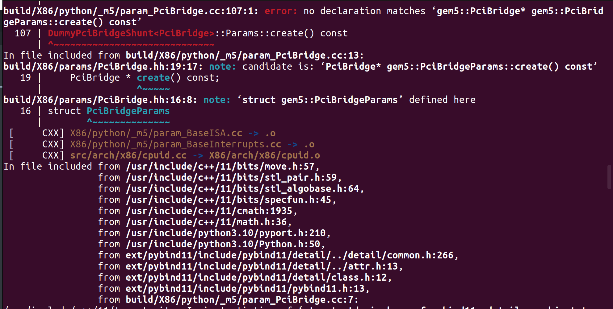

## Gem5使用/编译中遇到的问题

### 1.  error: no declaration matches "gem5::xxx* xxxxx::create() const"

#### create()函数的自动生成 （）

​	根据官网的教程[Creating a very simple SimObject](https://www.gem5.org/documentation/learning_gem5/part2/helloobject/)我们知道在C++文件中的.cc文件中要完成两个函数，一个是相应的构造函数，另一个是create()函数。create()函数的功能是调用SImObject()的构造函数，并且返回一个实例化的SimObject，由于我们创建的SimObject是以SimObject为基类的，create()函数在Gem5中是必不可少的。

​	但是如果你的构造函数满足一下的形式：

```
Foo(const FooParams &)
```

​	那么相应的FooParams::create()就会自动的实现，不需要你再去编写。

​	但是如果你的构造函数是按照这个形式来写的，然而发现在编译中仍然发现如图所示的错误：



​	会发现报错的是有关create()函数，但是这个函数式自动生成的，不应该会出现错误。在对比翻看了build文件夹下自动生成的有关我们自己定义的SimObject文件后，发现缺少了gem5的命名空间，同文件夹下的其他文件中的类都有gem5的命名空间。

​	最终的问题出现在.py文件上，因为在编写cxx_class的过程中就缺少了gem5::，导致这个错误。加上后，成功编译。


### 2. warn: no dot file generated. Please install pydot to generate the dot file

其实在之前我使用gem5的时候是生成了.dot文件的，但是当我重置了gem5源码的时候，就无法生成了。

安装pydot显示已经安装。查阅后发现pydot的使用一共有三个依赖：

+ pydot
+ pydotplus
+ Graphviz

发现这三个库都已安装，尝试卸载后，**按照顺序**安装pydot，pydotplus，Graphviz这三个库。重新运行发现仍然没有。

我直接利用github在仓库中搜索pydot，看到了配置文件中的一句话`apt-get install python3-dot`，然后执行了`sudo apt-get install python3-dot`，新安装了python3-dot。然后再次运行，发现生成了.dot文件以及配置图。原因可能是python多版本的问题。